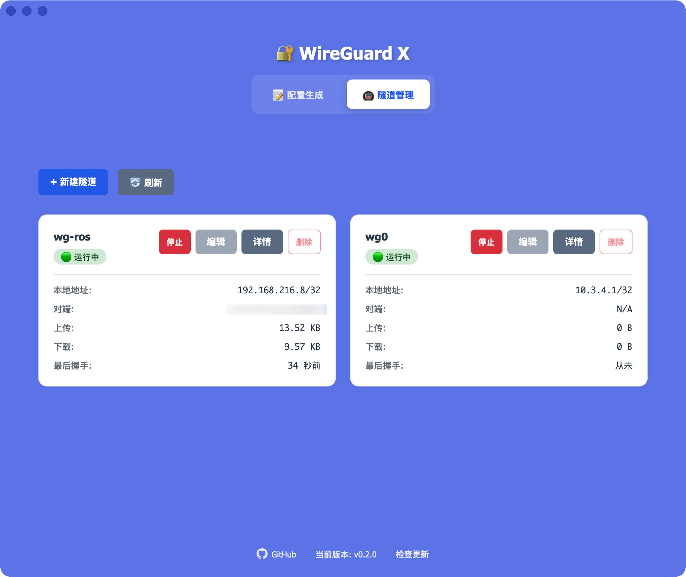

# 🚀 WG-X - WireGuard 隧道组网工具

一个基于 Tauri 2 + React 19 构建的桌面应用程序，**内置 wireguard-go**，让你无需安装额外组件即可快速建立 WireGuard 隧道，实现设备间的安全组网。同时支持多种配置格式导出，兼容标准 WireGuard、Surge、爱快、MikroTik、OpenWrt 等平台。




## ✨ 特性

### 隧道组网
- 🚇 **内置 WireGuard** - 集成 wireguard-go，无需额外安装 WireGuard 客户端
- ⚡ **一键建立隧道** - 快速启动 WireGuard 隧道，实现点对点或多点组网
- 🔐 **安全加密通信** - 基于 WireGuard 协议的端到端加密隧道
- 📊 **实时监控** - 查看隧道状态、流量统计、连接信息
- 🔄 **自动重连** - 网络中断后自动重建隧道连接

### 配置管理
- 🗄️ **多服务端管理** - 管理多个 WireGuard 服务端，Peer ID 独立计数，避免冲突
- 🔑 **密钥生成** - 基于 X25519 算法生成密钥对和预共享密钥（PSK）
- 📄 **多平台配置** - 一键生成 5 种格式：WireGuard、Surge、爱快、MikroTik、OpenWrt
- 📱 **二维码导入** - 自动生成二维码，移动设备扫码导入
- 💾 **配置持久化** - 自动保存配置，支持历史记录查询和批量导出

### 云同步
- ☁️ **WebDAV 同步** - 支持 Nextcloud、坚果云、群晖 NAS、威联通 NAS 等
- 🔄 **双向智能同步** - 基于文件时间戳自动上传/下载较新文件
- ⏰ **自动同步** - 可设置定时同步间隔（最少 60 秒）
- 🗑️ **删除同步** - 本地删除操作自动同步到远程

### 跨平台
- 📦 **桌面应用** - 基于 Tauri 2，支持 macOS、Windows、Linux
- 🔄 **自动更新** - 应用内检测和安装更新

## 🛠️ 技术栈

- **前端**: React 19.1.0 + Vite 7.0.4
- **桌面框架**: Tauri 2
- **后端**: Rust (Tauri 后端)
- **包管理器**: Yarn

## 📦 安装

### 下载安装包

从 [Releases](https://github.com/mrtian2016/wg-x/releases) 页面下载对应平台的安装包。

#### 🐧 Linux 用户安装指南

**首次使用需要安装守护进程**:

1. 下载或编译 wg-x 应用
2. 运行应用后,进入"设置"页面
3. 点击"安装守护进程"按钮
4. 输入管理员密码(会弹出 polkit 授权对话框)
5. 安装完成,即可使用隧道功能

**系统要求**:
- `wireguard-go` - WireGuard 用户空间实现
- `pkexec` (polkit) - 用于 GUI 安装授权
- `systemd` - 守护进程管理

**详细文档**: 查看 [Linux 守护进程安装指南](./INSTALL.md)

> 💡 **为什么需要守护进程?**
> Linux 下创建隧道需要 root 权限。守护进程以 root 运行并通过 systemd 管理,GUI 应用以普通用户运行,两者通过 Unix Socket 通信。这样用户无需每次都输入密码,体验更流畅。

#### ⚠️ macOS 用户注意事项

首次打开应用时,macOS 系统可能会提示 **"WG-X.app"已损坏,无法打开。你应该将它移到废纸篓。**

这是因为应用未经过 Apple 验证。请按以下步骤解决:

1. 打开"终端"应用
2. 执行以下命令(根据应用的实际安装位置调整路径):

```bash
# 如果安装在应用程序文件夹
sudo xattr -r -d com.apple.quarantine /Applications/WireGuard\ Config\ Generator.app

# 或者如果在其他位置,替换为实际路径
sudo xattr -r -d com.apple.quarantine /path/to/WireGuard\ Config\ Generator.app
```

3. 输入系统密码后,应用即可正常打开

> 💡 **这是什么操作?**
> `xattr` 命令用于移除 macOS 的隔离属性(quarantine)标记。这个标记会阻止从互联网下载的未签名应用运行。此操作仅移除限制,不会修改应用本身。

### 从源码构建

1. **克隆仓库**
```bash
git clone https://github.com/mrtian2016/wg-x.git
cd wg-x
```

2. **安装依赖**
```bash
yarn install
```

3. **开发模式运行**
```bash
yarn tauri dev
```

4. **构建应用**
```bash
yarn tauri build
```

构建产物位于 `src-tauri/target/release/bundle/`

## 🚀 使用指南

### 快速开始

#### 方式一：快速建立隧道（推荐）

1. **创建隧道配置**
   - 输入隧道名称（默认 `wg0`）
   - 自动生成密钥对，或导入已有私钥
   - 输入本地 IP 地址（CIDR 格式，如 `192.168.199.10/24`）

2. **配置对端节点**
   - 选择或创建服务端配置
   - 输入对端公钥和 Endpoint 地址（如 `example.com:51820`）
   - 设置允许访问的 IP 范围（AllowedIPs）

3. **启动隧道**
   - 点击"启动隧道"按钮
   - 隧道建立后可实时查看连接状态和流量统计
   - 支持随时停止、重启或切换配置

#### 方式二：生成配置文件

如果你需要在其他设备或路由器上使用，可以生成配置文件：

1. **客户端配置**
   - 输入配置文件名称（默认 `wg0`）
   - 生成或输入私钥（44 字符 Base64），公钥自动计算
   - 输入本地 IP 地址（CIDR 格式，如 `192.168.199.10/32`）
   - 可选：监听端口、DNS 服务器

2. **选择服务端**
   - 从列表选择已保存的服务端，或在"服务端管理"中新建
   - 每个服务端独立管理 Peer ID 计数器

3. **服务端信息**
   - 配置服务端公钥、Endpoint 地址（如 `example.com:51820`）
   - 可选：生成预共享密钥（PSK）增强安全性
   - 设置 AllowedIPs（`0.0.0.0/0,::/0` 为全局 VPN）
   - 设置 PersistentKeepalive（推荐 25 秒）

4. **客户端信息**
   - Peer ID 自动递增
   - 输入接口名称（默认 `wg_0`）
   - 输入备注名称（如 `iPhone`、`MacBook`）

5. **生成配置**
   - 自动生成 5 种格式：WireGuard (.conf)、Surge (.conf)、爱快 (.txt)、MikroTik (.rsc)、OpenWrt (.sh)
   - 支持二维码扫码导入（移动设备）
   - 自动保存到历史记录

## 💡 使用技巧

### 隧道组网场景

**场景一：家庭网络访问**
- 在家中搭建 WireGuard 服务端（路由器或 NAS）
- 外出时使用本应用快速连接家庭网络
- 访问家中的 NAS、监控设备、智能家居等

**场景二：多设备互联**
- 在公网服务器上搭建中转节点
- 多台设备通过隧道建立虚拟局域网
- 实现设备间的直接通信和文件共享

**场景三：远程办公**
- 连接公司 VPN，访问内部资源
- 支持分流路由，仅特定流量走隧道
- 保持其他网络正常访问

### WebDAV 同步配置示例

**Nextcloud**
```
服务器地址: https://cloud.example.com/remote.php/dav/files/username/
用户名: your_username
密码: 应用专用密码
```

**坚果云**
```
服务器地址: https://dav.jianguoyun.com/dav/
用户名: 账号邮箱
密码: 应用密码（在坚果云网页端生成）
```

建议同步间隔：300-600 秒（5-10 分钟）

### 常见问题

**Q: WG-X 和传统 WireGuard 客户端有什么区别？**
A: WG-X 内置 wireguard-go，无需安装额外客户端。同时提供图形化界面管理隧道，更适合快速建立临时连接和测试网络。

**Q: 是否需要管理员权限？**
A: macOS/Linux 需要管理员权限来创建虚拟网卡和配置路由。首次启动隧道时会提示授权。

**Q: 字段提示"不允许包含空格"？**
A: 关键字段（接口名称、密钥、IP 地址、备注）禁止空格，确保输入内容无空格。

**Q: 移动设备如何导入配置？**
A: 生成配置后，切换到"二维码"标签，用 WireGuard 应用扫描导入。

**Q: WebDAV 同步失败？**
A: 检查服务器地址、用户名密码、网络连接，坚果云需使用应用密码。

**Q: 如何迁移到新设备？**
A: 新设备上启用 WebDAV 同步，执行"立即同步"即可。

## 🔧 开发命令

### 前端开发
```bash
# 启动 Vite 开发服务器（仅前端）
yarn dev

# 构建前端
yarn build

# 预览构建结果
yarn preview
```

### Tauri 开发
```bash
# 启动 Tauri 开发模式（包含热重载）
yarn tauri dev

# 构建 Tauri 应用
yarn tauri build
```

### Rust 后端开发
```bash
cd src-tauri

# 检查 Rust 代码
cargo check

# 运行 Rust 测试
cargo test

# 格式化 Rust 代码
cargo fmt

# 运行 Clippy 检查
cargo clippy
```

## 📝 技术说明

### WireGuard-Go 集成

WG-X 内置了 [wireguard-go](https://git.zx2c4.com/wireguard-go/)，这是 WireGuard 的用户空间实现：

- **跨平台支持** - 纯 Go 实现，无需依赖内核模块
- **零依赖安装** - 用户无需单独安装 WireGuard 工具
- **虚拟网卡** - 创建 TUN 设备，处理隧道流量
- **自动路由** - 根据 AllowedIPs 自动配置路由表
- **性能优化** - 针对桌面环境优化的连接参数

### 数据存储

应用数据存储在以下目录：
- **macOS**: `~/Library/Application Support/com.wireguard.config-generator/`
- **Windows**: `%APPDATA%\com.wireguard.config-generator\`
- **Linux**: `~/.local/share/com.wireguard.config-generator/`

目录结构：
- `servers/` - 服务端配置文件（JSON）
- `history/` - 历史配置记录（JSON）
- `tunnels/` - 活动隧道状态和配置
- `webdav.json` - WebDAV 同步配置
- `last_sync.json` - 最后同步信息

### 密钥生成

- 基于 X25519 椭圆曲线 Diffie-Hellman 算法
- 私钥：32 字节随机数据，经过 clamping 处理
- 公钥：从私钥通过 X25519 基点计算得出
- 预共享密钥（PSK）：32 字节随机数据
- 所有密钥使用 Base64 编码（44 字符）

### 配置格式

#### 1. 标准 WireGuard 配置（.conf）
```ini
[Interface]
PrivateKey = xxx
Address = 192.168.199.10/32
ListenPort = 51820
DNS = 8.8.8.8

[Peer]
PublicKey = xxx
PresharedKey = xxx
Endpoint = example.com:51820
AllowedIPs = 0.0.0.0/0,::/0
PersistentKeepalive = 25
```
> 适用于标准 WireGuard 客户端（Windows、macOS、Linux、iOS、Android）

#### 2. Surge WireGuard 配置（.conf）
```
[WireGuard wg0]
private-key = xxx
self-ip = 192.168.199.10
dns-server = 8.8.8.8
mtu = 1280
peer = (public-key = xxx, preshared-key = xxx, allowed-ips = "0.0.0.0/0,::/0", endpoint = example.com:51820, keepalive = 25)
```
> 适用于 Surge iOS/macOS 客户端，可在 Surge 配置文件中直接使用

#### 3. 爱快路由器 Peer 配置（.txt）
```
id=1 enabled=yes comment=iPhone interface=wg_0 peer_publickey=xxx presharedkey=xxx allowips=192.168.199.10/32 endpoint= endpoint_port= keepalive=25
```
> 适用于爱快路由器，可在 Peer 管理界面批量导入

#### 4. MikroTik RouterOS 脚本（.rsc）
```
/interface wireguard peers
add allowed-address=192.168.199.10/32 comment="iPhone" interface=wg_0 public-key="xxx" preshared-key="xxx" persistent-keepalive=25s
```
> 适用于 MikroTik RouterOS，在终端中执行脚本自动添加 Peer

#### 5. OpenWrt UCI 配置脚本（.sh）
```bash
uci set network.wg0_peer_1=wireguard_wg_0
uci set network.wg0_peer_1.public_key='xxx'
uci set network.wg0_peer_1.preshared_key='xxx'
uci set network.wg0_peer_1.allowed_ips='192.168.199.10/32'
uci set network.wg0_peer_1.persistent_keepalive='25'
uci set network.wg0_peer_1.description='iPhone'
uci commit network
/etc/init.d/network reload
```
> 适用于 OpenWrt 路由器，通过 SSH 执行脚本自动添加 Peer

## 🤝 贡献

欢迎提交 Issue 和 Pull Request！

## 📄 许可证

MIT License

## 📋 更新日志

### v0.2.0 (开发中)
- 🚇 **内置 WireGuard-Go** - 集成用户空间 WireGuard 实现
- ⚡ **隧道管理** - 一键启动/停止隧道，实时监控连接状态
- 📊 **流量统计** - 实时显示上传/下载流量和握手时间
- 🔄 **自动重连** - 网络中断后自动恢复隧道连接
- 🎯 **场景优化** - 针对家庭网络、远程办公等场景优化体验

### v0.1.9 (2025-10-15)
- ☁️ WebDAV 云同步：双向智能同步、自动同步定时器、删除操作同步
- 🔄 自动更新：应用内检测更新、下载进度条、安装流程优化
- ✅ 表单验证：所有字段格式验证、禁止空格、AllowedIPs 格式统一

### v0.1.5 (2025-10-14)
- 🗄️ 多服务端管理：独立 Peer ID 计数、按服务端筛选历史、旧版数据迁移
- 🧹 清空功能优化：历史记录和服务端配置分离管理、二次确认
- 🍎 macOS 原生窗口：透明标题栏、固定窗口尺寸

### v0.1.4 (2025-10-13)
- ✨ 新增 Surge 配置支持
- 🌐 新增 OpenWrt 路由器支持
- 📦 历史记录增强：ZIP 批量导出

## 🙏 致谢

- [WireGuard](https://www.wireguard.com/) - 现代 VPN 协议
- [Tauri](https://tauri.app/) - 轻量级桌面应用框架
- [React](https://react.dev/) - UI 框架
- [Surge](https://nssurge.com/) - 强大的网络调试工具
- [爱快路由器](https://www.ikuai8.com/) - 企业级路由系统
- [MikroTik](https://mikrotik.com/) - 专业网络设备制造商
- [OpenWrt](https://openwrt.org/) - 开源路由器固件

---

**WG-X - Fast WireGuard Tunnel Manager with Built-in wireguard-go**
