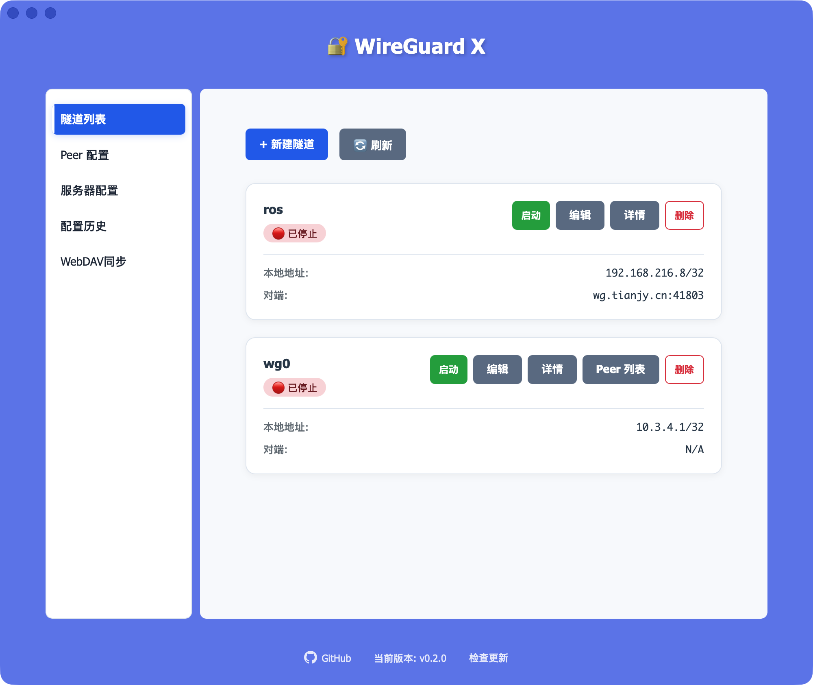

# WireGuard X (WG-X)

一个跨平台的 WireGuard VPN 客户端和隧道管理工具，支持 macOS、Windows 和 Linux。提供友好的图形界面和强大的配置管理功能。


## 🌟 主要功能特性

### 隧道管理
- **隧道列表管理** - 创建、保存、加载、删除和管理多个 WireGuard 隧道配置
- **隧道启动/停止** - 一键启动和停止 WireGuard 隧道
- **隧道详情查看** - 实时查看隧道的详细信息和运行状态
- **隧道状态监控** - 获取隧道列表和详细的隧道运行统计信息
- **Peer 统计监听** - 实时监听和推送 Peer 连接统计数据

### Peer 配置生成
- **密钥对生成** - 使用 X25519 算法生成安全的公私钥对
- **预共享密钥生成** - 生成用于额外加密的预共享密钥 (PSK)
- **本地地址自动生成** - 支持自动生成私有网络地址 (10.0.0.0/8, 172.16.0.0/12, 192.168.0.0/16)
- **AllowedIPs 自动配置** - 根据本地 IP 自动生成允许的 IP 段配置
- **QR 码生成** - 生成 WireGuard 配置的二维码，方便移动设备扫描导入

### 多格式配置输出
支持生成多种设备和平台的配置文件：
- **WireGuard 配置** (.conf) - 标准 WireGuard 格式，可用于 wg-quick 等工具
- **iKuai 配置** - 爱快路由器专用格式
- **Surge 配置** - Surge 代理工具专用格式
- **MikroTik 配置** - MikroTik 路由器专用格式
- **OpenWrt 配置** - OpenWrt 开源路由器系统专用格式

### 多服务器管理
- **支持多服务器** - 保存和管理多个 VPN 服务器配置
- **服务器详情编辑** - 查看和编辑服务器的完整配置信息
- **Peer ID 管理** - 为每个服务器自动分配和管理 Peer ID
- **配置迁移** - 自动迁移旧版本的单服务器配置到新的多服务器架构

### 历史记录管理
- **配置历史保存** - 自动保存所有生成的配置历史记录
- **历史列表查看** - 按时间顺序查看所有历史配置
- **按服务器筛选** - 按照所属的 VPN 服务器筛选历史记录
- **批量导出** - 导出所有配置为 ZIP 压缩包
- **快速清空** - 一键删除所有历史记录

### WebDAV 云同步
- **WebDAV 配置** - 支持保存 WebDAV 服务器连接信息
- **连接测试** - 测试与 WebDAV 服务器的连接状态
- **单向同步** - 支持上传到 WebDAV 或从 WebDAV 下载
- **双向同步** - 智能合并和同步本地与远程配置
- **自动同步** - 设置同步间隔，实现定时自动同步

### 本地网络探测
- **本地 IP 检测** - 获取设备的网络接口 IP 地址
- **多接口支持** - 获取所有本地网络接口的 IP 地址列表
- **虚拟设备过滤** - 自动过滤虚拟网络接口
- **跨平台支持** - 在 Windows、macOS 和 Linux 上自动检测

### Linux 守护进程支持
- **守护进程模式** - Linux 上支持后台守护进程运行
- **服务管理** - 安装、卸载、启动、停止 WG-X 系统服务
- **自启动控制** - 设置守护进程的自启动状态
- **日志查看** - 查看守护进程的运行日志

### 应用更新管理
- **自动更新检查** - 应用启动时自动检查是否有新版本
- **手动检查** - 用户可以随时手动检查更新
- **自动下载安装** - 支持自动下载新版本并安装
- **进度显示** - 显示更新下载和安装的进度

## 📸 应用界面预览



*隧道列表管理界面 - 显示多个隧道的配置和状态*

## 🛠️ 技术栈

### 前端
- **React 19.1.0** - UI 框架
- **Vite 7.0.4** - 快速开发和构建工具
- **Tauri 2** - 跨平台桌面应用框架

### Rust 后端
- **tauri 2** - 应用框架核心
- **tokio 1** - 异步运行时
- **x25519-dalek 2** - X25519 密钥交换实现
- **qrcode 0.14** - 二维码生成
- **serde/serde_json** - 序列化反序列化
- **reqwest 0.12.24** - HTTP 客户端（WebDAV 同步）
- **quick-xml 0.38.3** - XML 解析（WebDAV 协议）
- **chrono 0.4.42** - 日期时间处理

### Tauri 插件
- **tauri-plugin-opener** - 在浏览器中打开 URL
- **tauri-plugin-dialog** - 文件选择对话框
- **tauri-plugin-shell** - Shell 命令执行
- **tauri-plugin-cli** - 命令行参数处理
- **tauri-plugin-log** - 日志管理
- **tauri-plugin-process** - 进程管理
- **tauri-plugin-updater** - 应用自动更新

## 📦 安装

### 系统要求
- **macOS**: 10.13 或更高版本
- **Windows**: Windows 10 或更高版本
  - ⚠️ **需要先安装官方 WireGuard 程序** - 从 [wireguard.com](https://www.wireguard.com/install/) 下载安装
- **Linux**: 支持 glibc 的 Linux 发行版

### 下载安装
从 [Releases](https://github.com/pyer/wg-x/releases) 页面下载对应平台的安装文件：
- macOS: `.dmg` 文件
- Windows: `.msi` 或 `.exe` 文件（需先安装 WireGuard）
- Linux: `.deb` 或其他发行版对应的安装包

### ⚠️ macOS 用户注意事项

首次打开应用时，macOS 系统可能会提示 **"WireGuard Config Generator.app"已损坏，无法打开。你应该将它移到废纸篓。**

这是因为应用未经过 Apple 验证。请按以下步骤解决：

1. 打开"终端"应用
2. 执行以下命令（根据应用的实际安装位置调整路径）：

```bash
# 如果安装在应用程序文件夹
sudo xattr -r -d com.apple.quarantine /Applications/WireGuard\ Config\ Generator.app

# 或者如果在其他位置，替换为实际路径
sudo xattr -r -d com.apple.quarantine /path/to/WireGuard\ Config\ Generator.app
```

3. 输入系统密码后，应用即可正常打开

> 💡 **这是什么操作？**
> `xattr` 命令用于移除 macOS 的隔离属性(quarantine)标记。这个标记会阻止从互联网下载的未签名应用运行。此操作仅移除限制，不会修改应用本身。

## 🚀 快速开始

### 前置要求
- Node.js 18+
- Rust 工具链
- Yarn 包管理器

### 开发

```bash
# 克隆仓库
git clone https://github.com/pyer/wg-x.git
cd wg-x

# 安装依赖
yarn install

# 启动开发模式
yarn tauri dev
```

### 构建

```bash
yarn tauri build
```

## 📁 项目结构

```
wg-x/
├── src/                    # React 前端代码
│   ├── pages/             # 页面：隧道管理、配置生成、服务器、历史、WebDAV
│   └── components/        # UI 组件：通知、对话框、守护进程面板等
├── src-tauri/             # Rust 后端
│   ├── src/
│   │   ├── lib.rs         # 主应用逻辑
│   │   ├── tunnel.rs      # 隧道管理
│   │   ├── webdav.rs      # WebDAV 同步
│   │   └── commands/      # Tauri 命令处理
│   ├── Cargo.toml         # Rust 依赖
│   └── tauri.conf.json    # Tauri 配置
└── package.json           # Node.js 依赖
```

## 🐧 Linux 守护进程

在 Linux 上可以作为系统服务运行在后台。

## 🔐 安全性

- 密钥生成在本地进行
- 支持预共享密钥 (PSK) 增强加密
- 配置文件受操作系统保护

## 🤝 贡献

欢迎提交 Issues 和 Pull Requests！

## 📄 许可证

MIT License - 详见 LICENSE 文件

## 🔗 相关资源

- [WireGuard 官网](https://www.wireguard.com/)
- [Tauri 文档](https://tauri.app/)
- [React 文档](https://react.dev/)

## 📞 支持

如有问题或建议，请在 GitHub 中提交 Issue。

